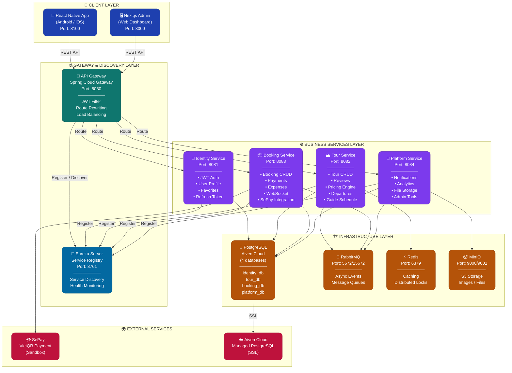
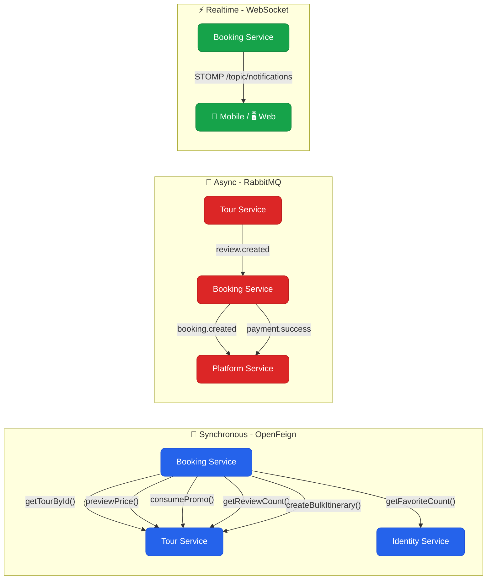
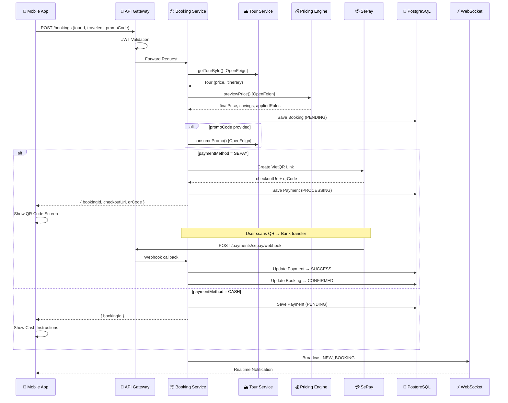
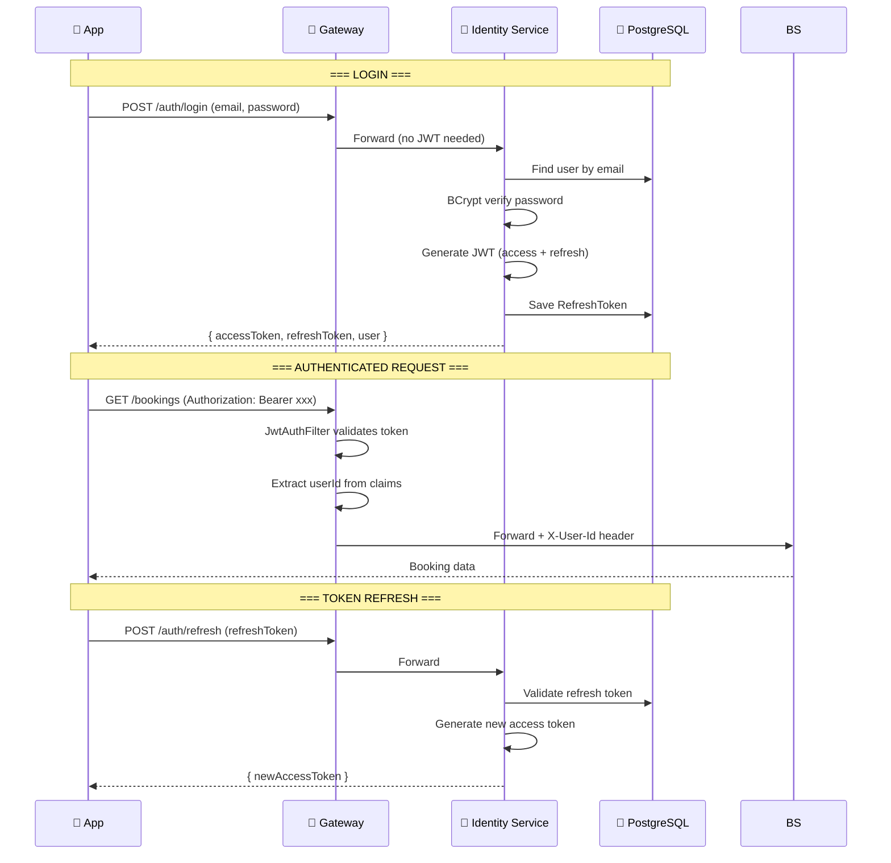
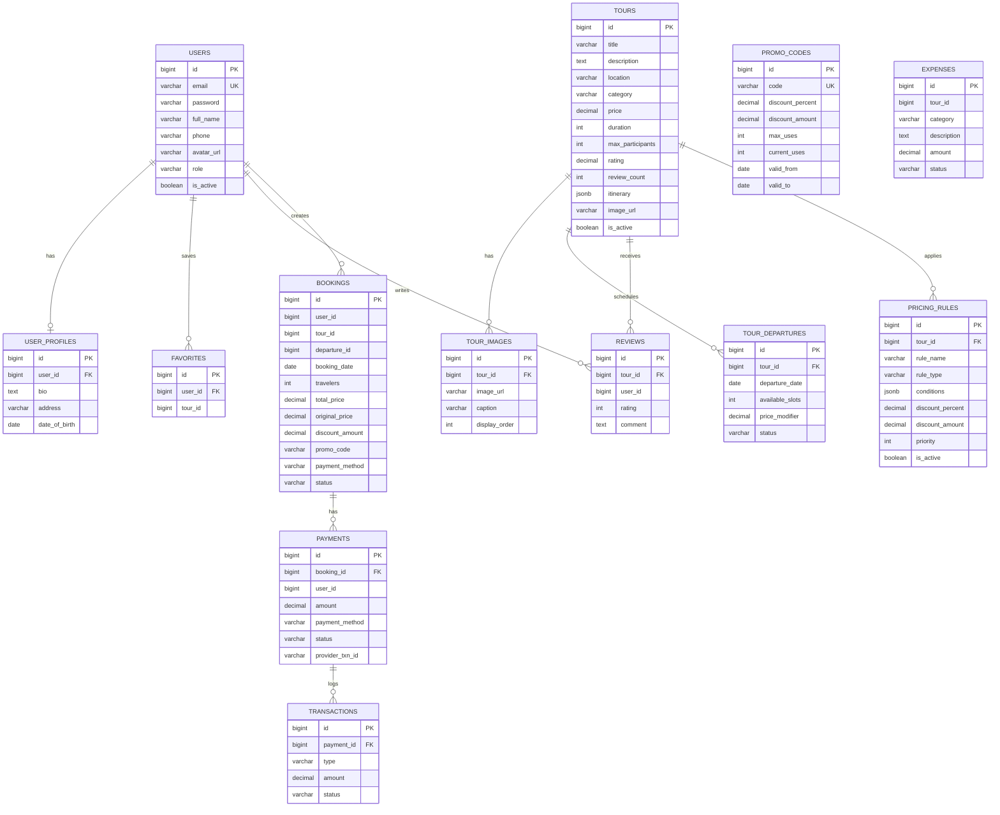
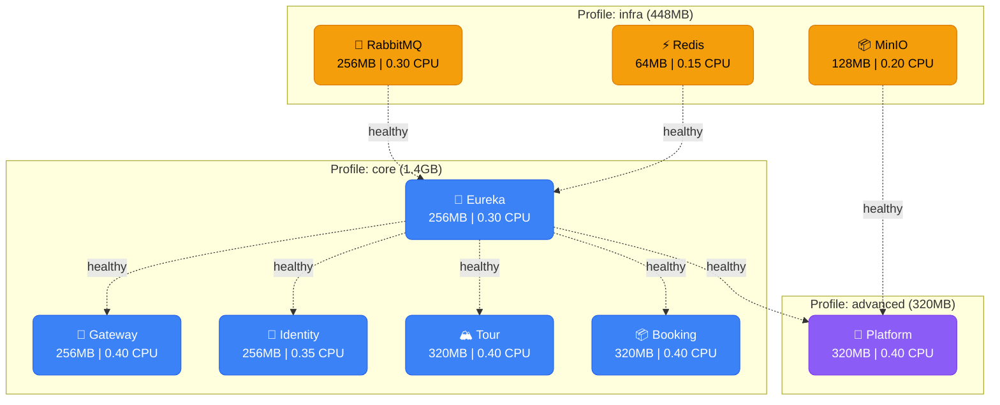
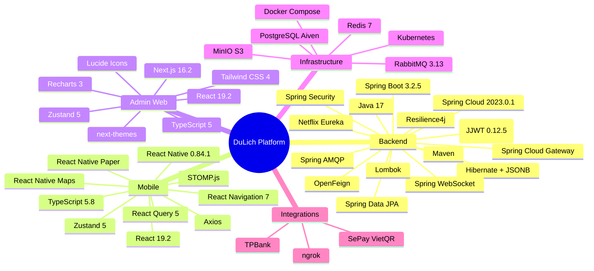

# 🏗️ DuLich Platform — Sơ Đồ Kiến Trúc Microservices

> **Updated**: 2026-05-14

---

## 1. Tổng Quan Kiến Trúc

---

## 2. Luồng Giao Tiếp Giữa Services

---

## 3. Luồng Đặt Tour & Thanh Toán

---

## 4. Luồng Xác Thực (JWT)

---

## 5. Database Schema (Entity Relationship)

---

## 6. Docker Compose — Container Topology

**Tổng RAM**: ~2.2GB (dev mode, optimized for 8GB laptop)

---

## 7. Tech Stack Matrix

