# PLAN: Tối Ưu Tốc Độ Tìm Kiếm & Get All Endpoints

## Mô Tả Vấn Đề

Hiện tại toàn bộ backend **không có pagination, không có caching, không có database indexes, và mắc lỗi N+1 query nghiêm trọng**. Khi dữ liệu tăng, mọi endpoint sẽ chậm dần đến mức timeout.

### Các Bottleneck Đã Phát Hiện

| # | Bottleneck | Mức Độ | Ảnh Hưởng |
|---|-----------|--------|-----------|
| 1 | **N+1 Query — `enrichBooking()`** | 🔴 Critical | `GET /bookings` gọi Feign `getTourById()` cho **MỖI booking**. 50 bookings = 50 HTTP requests cross-service. Đây là nguyên nhân chính gây timeout 15s trên admin dashboard. |
| 2 | **Không có Pagination** | 🔴 Critical | Mọi `findAll()` trả **toàn bộ bảng** vào memory. Không có `Pageable` ở bất kỳ repository/controller nào. |
| 3 | **Không có Database Index** | 🟡 High | Không có `@Index` annotation nào trên entity. Các truy vấn `findByUserId`, `findByStatus`, `searchTours(LIKE)` đều full table scan. |
| 4 | **Không có Caching** | 🟡 High | Redis đã cấu hình nhưng chưa dùng `@Cacheable`. Tour data (ít thay đổi) bị fetch lại mỗi request. |
| 5 | **`FetchType.EAGER` trên Tour** | 🟡 High | `Tour.images` và `Tour.departures` dùng `FetchType.EAGER` → mỗi lần load tour đều kéo theo 2 bảng con dù không cần. |
| 6 | **Tour search dùng `LIKE '%keyword%'`** | 🟠 Medium | Không thể dùng B-tree index cho `LIKE '%..%'`. Cần GIN/trigram index cho PostgreSQL. |

---

## Proposed Changes

### Phase 1: Fix N+1 — Batch Enrichment (Ưu tiên cao nhất)

> **Mục tiêu:** Giảm 50 HTTP calls → 1 HTTP call cho `getAllBookingResponses()`

#### [MODIFY] [TourServiceClient.java](file:///d:/Antigravity/Beo/DuLich/backend/booking-service/src/main/java/com/dulich/booking/client/TourServiceClient.java)
- Thêm endpoint batch: `@GetMapping("/tours/batch?ids=1,2,3")` → trả `List<TourResponse>`

#### [MODIFY] [TourController.java](file:///d:/Antigravity/Beo/DuLich/backend/tour-service/src/main/java/com/dulich/tour/controller/TourController.java)
- Thêm `@GetMapping("/batch")` nhận `@RequestParam List<Long> ids`
- Gọi `tourRepository.findAllById(ids)`

#### [MODIFY] [TourService.java](file:///d:/Antigravity/Beo/DuLich/backend/tour-service/src/main/java/com/dulich/tour/service/TourService.java)
- Thêm `getToursByIds(List<Long> ids)` → `findAllById(ids)`

#### [MODIFY] [BookingService.java](file:///d:/Antigravity/Beo/DuLich/backend/booking-service/src/main/java/com/dulich/booking/service/BookingService.java)
- Refactor `getAllBookingResponses()`:
  ```java
  // BEFORE (N+1): 50 bookings = 50 Feign calls
  bookings.stream().map(this::enrichBooking).toList();
  
  // AFTER (Batch): 50 bookings = 1 Feign call
  Set<Long> tourIds = bookings.stream().map(Booking::getTourId).collect(toSet());
  Map<Long, TourResponse> tourMap = tourServiceClient.getToursByIds(tourIds)
      .stream().collect(toMap(TourResponse::getId, t -> t));
  bookings.stream().map(b -> enrichFromMap(b, tourMap)).toList();
  ```
- Áp dụng tương tự cho `getBookingResponsesByUserId()`

---

### Phase 2: Server-Side Pagination

> **Mục tiêu:** Không bao giờ trả toàn bộ bảng. Mặc định `page=0&size=20`.

#### [MODIFY] Repositories — Thêm `Pageable` variants

| Repository | Method hiện tại | Method mới |
|-----------|----------------|-----------|
| `BookingRepository` | `findAll()` | `Page<Booking> findAll(Pageable)` (có sẵn từ JpaRepository) |
| `BookingRepository` | `findByUserIdOrderByCreatedAtDesc()` | `Page<Booking> findByUserIdOrderByCreatedAtDesc(Long, Pageable)` |
| `TourRepository` | `searchTours()` | `Page<Tour> searchTours(String, Pageable)` |
| `ReviewRepository` | `findByTourIdOrderByCreatedAtDesc()` | `Page<Review> findByTourId...(Long, Pageable)` |
| `NotificationRepository` | `findByUserIdOrderByCreatedAtDesc()` | `Page<Notification> findByUserId...(Long, Pageable)` |
| `ExpenseRepository` | `findByTourIdOrderByCreatedAtDesc()` | `Page<Expense> findByTourId...(Long, Pageable)` |

#### [MODIFY] Controllers — Nhận params `page`, `size`

Mỗi controller endpoint "list" sẽ thêm:
```java
@GetMapping
public ResponseEntity<Page<BookingResponse>> getAllBookings(
    @RequestParam(defaultValue = "0") int page,
    @RequestParam(defaultValue = "20") int size) {
    return ResponseEntity.ok(bookingService.getAllBookingResponses(PageRequest.of(page, size)));
}
```

#### [NEW] [PageResponse.java](file:///d:/Antigravity/Beo/DuLich/backend/booking-service/src/main/java/com/dulich/booking/dto/PageResponse.java)
- DTO wrapper chuẩn cho paginated responses: `{ content, totalElements, totalPages, currentPage }`

> [!IMPORTANT]
> Frontend (web admin) hiện gọi `bookingsApi.list()` và expect `Array`. Cần update `web/src/lib/api.ts` để handle paginated response format `{ content: [...], totalPages, ... }`.

---

### Phase 3: Database Indexes

> **Mục tiêu:** Loại bỏ full table scan cho các truy vấn phổ biến.

#### [MODIFY] Entities — Thêm `@Table(indexes = ...)`

| Entity | Index | Columns | Lý do |
|--------|-------|---------|-------|
| `Booking` | `idx_booking_user_id` | `user_id` | `findByUserId` — truy vấn cực kỳ phổ biến |
| `Booking` | `idx_booking_status` | `status` | `findByStatus`, filter admin dashboard |
| `Booking` | `idx_booking_tour_id` | `tour_id` | JOIN với tour data khi enrich |
| `Booking` | `idx_booking_created_at` | `created_at` | ORDER BY DESC (mọi list query) |
| `Payment` | `idx_payment_booking_id` | `booking_id` | `findByBookingId` |
| `Payment` | `idx_payment_provider_tx` | `provider_transaction_id` | payOS webhook lookup |
| `Review` | `idx_review_tour_id` | `tour_id` | `findByTourId` — reviews per tour |
| `Review` | `idx_review_user_id` | `user_id` | `findByUserId` |
| `Expense` | `idx_expense_tour_id` | `tour_id` | `findByTourId` |
| `Notification` | `idx_notif_user_id` | `user_id, is_read` | `findByUserId` + unread count |
| `Tour` | `idx_tour_category` | `category` | `findByCategory` |
| `Tour` | `idx_tour_location` | `location` | `findByLocations` |

#### [NEW] `V2__add_indexes.sql` — Flyway migration (hoặc manual SQL)
```sql
CREATE INDEX idx_booking_user_id ON bookings(user_id);
CREATE INDEX idx_booking_status ON bookings(status);
CREATE INDEX idx_booking_tour_id ON bookings(tour_id);
CREATE INDEX idx_booking_created_at ON bookings(created_at DESC);
-- ... tương tự cho các bảng khác
```

> [!NOTE]
> Nếu dùng `spring.jpa.hibernate.ddl-auto=update`, JPA tự tạo index từ `@Table(indexes)`. Nếu dùng Flyway/migration thì cần file SQL riêng.

---

### Phase 4: Redis Caching

> **Mục tiêu:** Cache dữ liệu ít thay đổi (tours, pricing rules) để giảm DB load.

#### [MODIFY] Application config — Enable caching
```yaml
spring:
  cache:
    type: redis
    redis:
      time-to-live: 600000  # 10 min
```

#### [MODIFY] [TourService.java](file:///d:/Antigravity/Beo/DuLich/backend/tour-service/src/main/java/com/dulich/tour/service/TourService.java)
```java
@Cacheable(value = "tours", key = "'all'")
public List<Tour> getAllTours() { ... }

@Cacheable(value = "tours", key = "#id")
public Tour getTourById(Long id) { ... }

@CacheEvict(value = "tours", allEntries = true)
public Tour createTour(Tour tour) { ... }

@CacheEvict(value = "tours", allEntries = true)
public Tour updateTour(Long id, Tour tour) { ... }
```

#### [MODIFY] Main Application classes
- Thêm `@EnableCaching` trên `TourServiceApplication` và `BookingServiceApplication`

> [!WARNING]
> Redis đã có trong Docker Compose nhưng `tour-service` hiện không có dependency Redis. Cần thêm `spring-boot-starter-data-redis` và `spring-boot-starter-cache` vào `pom.xml` của tour-service.

---

### Phase 5: Fix Tour EAGER Loading

> **Mục tiêu:** Chuyển `images` và `departures` sang `LAZY` để giảm data load khi list tours.

#### [MODIFY] [Tour.java](file:///d:/Antigravity/Beo/DuLich/backend/tour-service/src/main/java/com/dulich/tour/entity/Tour.java)
```java
// BEFORE
@OneToMany(mappedBy = "tour", cascade = CascadeType.ALL, fetch = FetchType.EAGER)
private List<TourImage> images;

// AFTER
@OneToMany(mappedBy = "tour", cascade = CascadeType.ALL, fetch = FetchType.LAZY)
private List<TourImage> images;
```

#### [MODIFY] TourService / TourController
- Endpoint `GET /tours` (list) → dùng DTO projection (chỉ trả `id, title, location, price, imageUrl, rating`) **không kéo images/departures**
- Endpoint `GET /tours/{id}` (detail) → dùng `@EntityGraph` hoặc manual JOIN FETCH để eager load khi cần

#### [NEW] [TourSummaryDTO.java](file:///d:/Antigravity/Beo/DuLich/backend/tour-service/src/main/java/com/dulich/tour/dto/TourSummaryDTO.java)
- Lightweight DTO cho list endpoint: chỉ chứa fields cần thiết cho card UI

---

### Phase 6: Full-Text Search Optimization (Tour Search)

> **Mục tiêu:** Tìm kiếm tour nhanh hơn bằng PostgreSQL trigram index.

#### [NEW] SQL migration — Trigram index
```sql
CREATE EXTENSION IF NOT EXISTS pg_trgm;
CREATE INDEX idx_tour_title_trgm ON tours USING GIN (title gin_trgm_ops);
CREATE INDEX idx_tour_location_trgm ON tours USING GIN (location gin_trgm_ops);
```

> [!NOTE]
> Đây là tùy chọn nâng cao. Chỉ cần nếu số lượng tour > 100 và search response time > 200ms. Với 12 tours hiện tại, B-tree index trên `category` là đủ.

---

## Thứ Tự Ưu Tiên Thực Hiện

```mermaid
gantt
    title Lộ trình tối ưu
    dateFormat  X
    axisFormat %s
    
    section Critical
    Phase 1 - Fix N+1 Batch     :crit, p1, 0, 2
    Phase 2 - Pagination        :crit, p2, 2, 4
    
    section High
    Phase 3 - DB Indexes        :p3, 4, 5
    Phase 4 - Redis Caching     :p4, 5, 7
    
    section Medium
    Phase 5 - LAZY Loading      :p5, 7, 8
    Phase 6 - FTS Trigram       :p6, 8, 9
```



| Phase | Impact | Effort | ROI |
|-------|--------|--------|-----|
| 1. Fix N+1 | 🔴 Rất cao (giảm 50x HTTP calls) | Nhỏ (2 files) | ⭐⭐⭐⭐⭐ |
| 2. Pagination | 🔴 Rất cao (giảm memory + payload) | Trung bình (10+ files) | ⭐⭐⭐⭐⭐ |
| 3. DB Indexes | 🟡 Cao (giảm query time) | Nhỏ (SQL/annotations) | ⭐⭐⭐⭐ |
| 4. Redis Cache | 🟡 Cao (giảm DB load 80%) | Trung bình (config + annotations) | ⭐⭐⭐⭐ |
| 5. LAZY Load | 🟡 Cao (giảm payload 60%) | Nhỏ (1 file) | ⭐⭐⭐⭐ |
| 6. FTS Trigram | 🟠 Trung bình | Nhỏ (SQL) | ⭐⭐⭐ |

---

## Open Questions

> [!IMPORTANT]
> 1. **Frontend admin pagination:** Web admin hiện load toàn bộ bookings rồi paginate client-side. Bạn muốn chuyển sang server-side pagination luôn hay giữ client-side cho giờ?
> 2. **Mobile pagination:** App mobile có cần infinite scroll / load more pattern không?
> 3. **Cache TTL:** Tour data cache 10 phút có phù hợp không? Hay bạn muốn cache lâu hơn (1 giờ)?

---

## Verification Plan

### Automated Tests
```bash
# Chạy test_api.py để verify endpoints vẫn hoạt động
python backend/test_api.py

# Check response time
curl -w "\n%{time_total}s" http://localhost:8080/api/bookings
curl -w "\n%{time_total}s" http://localhost:8080/api/tours
```

### Manual Verification
1. **Before/After benchmark:** So sánh response time của `GET /api/bookings` trước và sau khi fix N+1
2. **Pagination test:** Verify `?page=0&size=5` trả đúng 5 items + metadata
3. **Cache test:** Gọi `GET /api/tours` 2 lần → lần 2 phải nhanh hơn đáng kể
4. **Index verify:** `EXPLAIN ANALYZE` trên PostgreSQL để confirm index usage
