# Sơ Đồ Luồng Xử Lý & Biểu Đồ Tuần Tự — DuLich Platform

> **Tài liệu kỹ thuật**: Mô tả chi tiết các luồng xử lý (Flowcharts) và tương tác giữa các thành phần (Sequence Diagrams) trong hệ thống đặt tour du lịch.

---

## Mục Lục

| # | Luồng | Flowchart | Sequence |
|---|-------|:---------:|:--------:|
| 1 | Đăng ký & Đăng nhập | ✅ | ✅ |
| 2 | Tìm kiếm & Xem tour | ✅ | ✅ |
| 3 | Đặt tour (Booking Saga) | ✅ | ✅ |
| 4 | Thanh toán tiền mặt | ✅ | ✅ |
| 5 | Thanh toán VietQR (SePay) | ✅ | ✅ |
| 6 | Viết đánh giá | ✅ | ✅ |
| 7 | Quản lý chi phí (Guide → Admin) | ✅ | ✅ |
| 8 | Thông báo Realtime | ✅ | ✅ |
| 9 | Quản lý tour (Admin CRUD) | ✅ | ✅ |
| 10 | Quản lý Booking (Admin) | ✅ | ✅ |

---

## 1. Đăng Ký & Đăng Nhập

### 1.1 Flowchart — Luồng Xác Thực

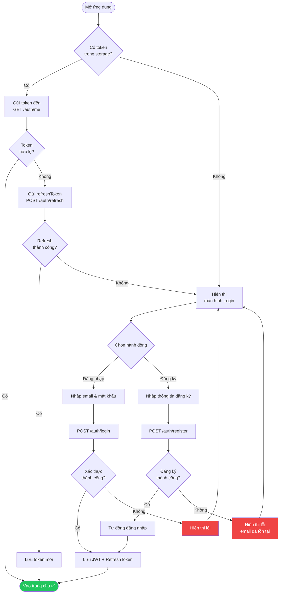

### 1.2 Sequence Diagram — Đăng Nhập

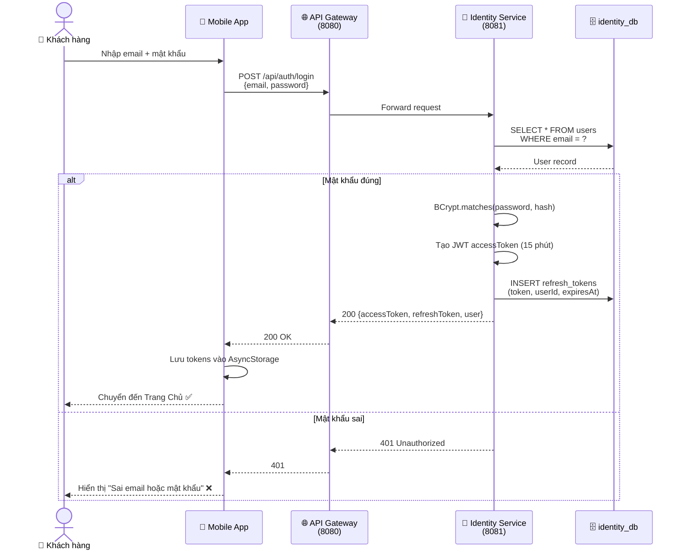

---

## 2. Tìm Kiếm & Xem Tour

### 2.1 Flowchart — Luồng Khám Phá Tour

```mermaid
flowchart TD
    A([Trang Chủ]) --> B[Tải danh sách tour<br/>GET /tours]
    B --> C{Người dùng<br/>muốn gì?}
    
    C -->|Tìm kiếm| D[Nhập từ khóa /<br/>bộ lọc]
    C -->|Xem tour| E[Chọn 1 tour]
    C -->|Yêu thích| F[Tab Yêu Thích]
    
    D --> G[GET /tours?keyword=...&<br/>location=...&minPrice=...]
    G --> H[Hiển thị kết quả<br/>tìm kiếm]
    H --> E
    
    E --> I[GET /tours/{tourId}]
    I --> J[Hiển thị chi tiết tour]
    J --> K{Hành động}
    
    K -->|Thêm yêu thích| L[POST /favorites<br/>{tourId}]
    K -->|Xem đánh giá| M[GET /reviews/tour/{tourId}]
    K -->|Đặt tour| N([Chuyển sang<br/>Booking Flow →])
    K -->|Quay lại| C
    
    F --> O[GET /favorites/user/{userId}]
    O --> P[Hiển thị danh sách<br/>tour yêu thích]
    P --> E

    L --> Q{Đã yêu thích<br/>trước đó?}
    Q -->|Chưa| R[Thêm vào yêu thích ❤️]
    Q -->|Rồi| S[Xóa khỏi yêu thích 🤍]

    style N fill:#3b82f6,color:#fff
```

### 2.2 Sequence Diagram — Xem Chi Tiết Tour

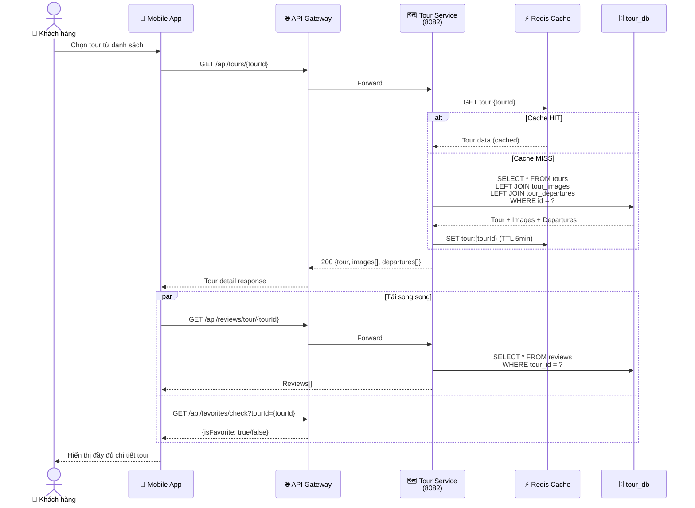

---

## 3. Đặt Tour (Booking Saga)

### 3.1 Flowchart — Luồng Đặt Tour End-to-End

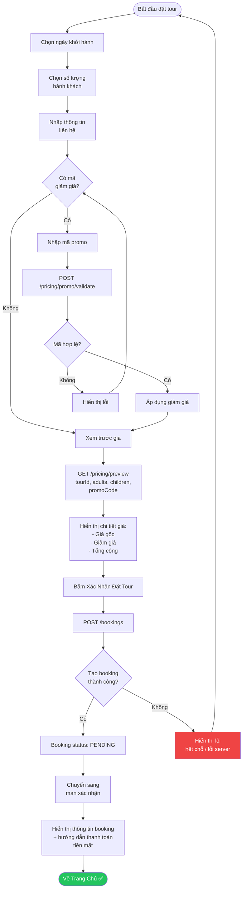

### 3.2 Sequence Diagram — Booking Saga (Toàn Bộ Luồng)

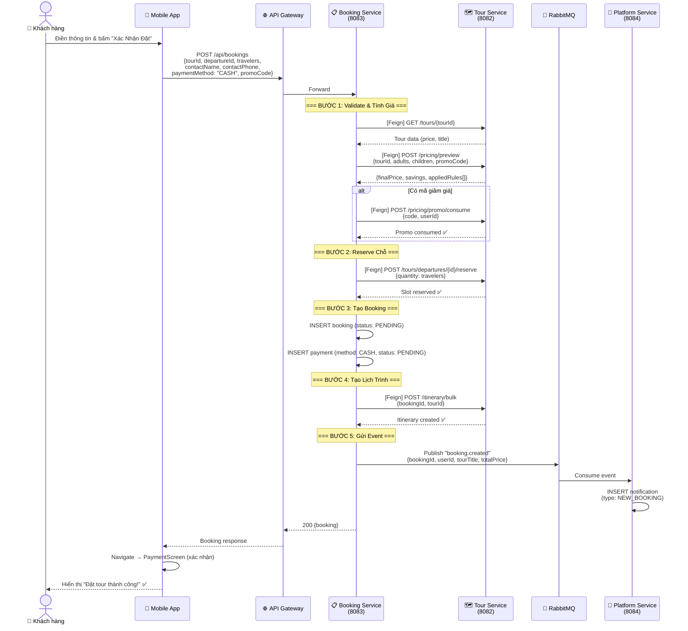

---

## 4. Thanh Toán Tiền Mặt

### 4.1 Flowchart — Xác Nhận Tiền Mặt

```mermaid
flowchart TD
    A([Booking PENDING]) --> B[Khách hàng đến<br/>điểm khởi hành]
    B --> C[Gặp hướng dẫn viên]
    C --> D[Thanh toán tiền mặt]
    D --> E[HDV xác nhận<br/>đã nhận tiền]
    
    E --> F[Admin vào Dashboard]
    F --> G[Tìm đơn booking]
    G --> H[POST /payments/{id}/confirm-cash]
    
    H --> I[Payment → SUCCESS]
    I --> J[Booking → CONFIRMED]
    J --> K([Tour bắt đầu ✅])

    L([Quá 24 giờ<br/>không thanh toán]) --> M[System tự động hủy]
    M --> N[Booking → CANCELLED]
    N --> O[Trả lại chỗ<br/>cho departure]

    style K fill:#22c55e,color:#fff
    style N fill:#ef4444,color:#fff
```

### 4.2 Sequence Diagram — Xác Nhận Thanh Toán Tiền Mặt

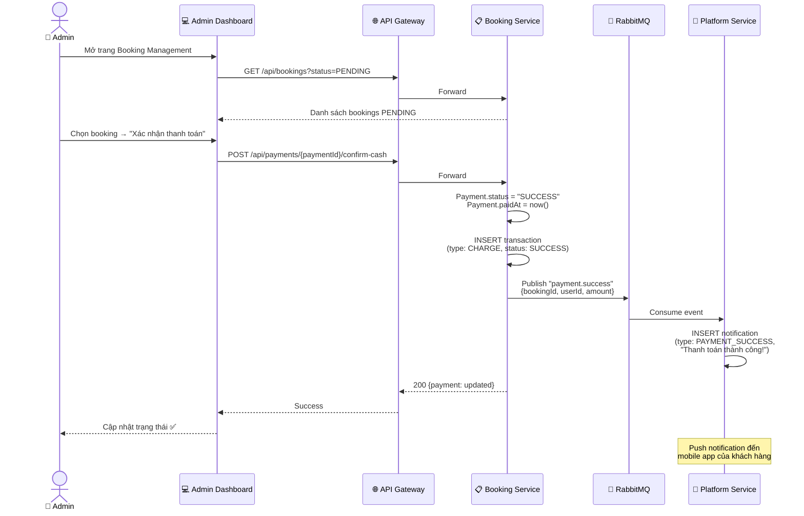

---

## 5. Thanh Toán VietQR (SePay)

### 5.1 Flowchart — Luồng SePay

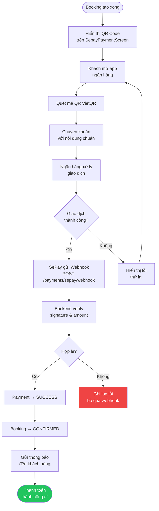

### 5.2 Sequence Diagram — VietQR SePay End-to-End

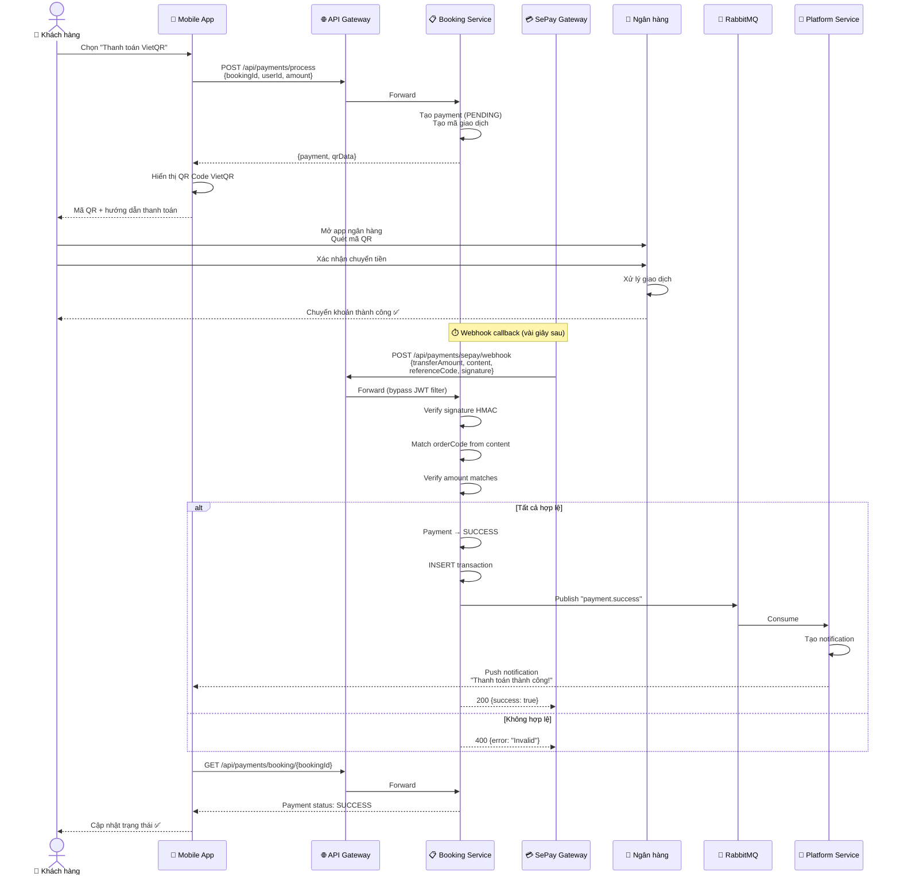

---

## 6. Viết Đánh Giá

### 6.1 Flowchart — Luồng Đánh Giá Tour

```mermaid
flowchart TD
    A([Xem chi tiết tour]) --> B[Bấm "Viết đánh giá"]
    B --> C[GET /reviews/can-review<br/>?tourId=X&userId=Y]
    
    C --> D{Có quyền<br/>đánh giá?}
    
    D -->|Không — Chưa đi tour| E[Hiển thị:<br/>"Bạn cần hoàn thành tour<br/>trước khi đánh giá"]
    D -->|Không — Đã đánh giá| F[Hiển thị:<br/>"Bạn đã đánh giá<br/>tour này rồi"]
    
    D -->|Có| G[Hiển thị form đánh giá]
    G --> H[Nhập rating ⭐<br/>1-5 sao]
    H --> I[Nhập nội dung<br/>đánh giá]
    I --> J[Bấm Gửi]
    
    J --> K[POST /reviews<br/>{tourId, rating, comment}]
    K --> L{Gửi thành công?}
    
    L -->|Có| M[Publish event<br/>review.created]
    L -->|Không| N[Hiển thị lỗi] --> G
    
    M --> O[Cập nhật rating<br/>trung bình của tour]
    O --> P([Đánh giá đã<br/>được đăng ✅])

    style P fill:#22c55e,color:#fff
    style E fill:#f59e0b,color:#fff
    style F fill:#f59e0b,color:#fff
```

### 6.2 Sequence Diagram — Tạo Đánh Giá

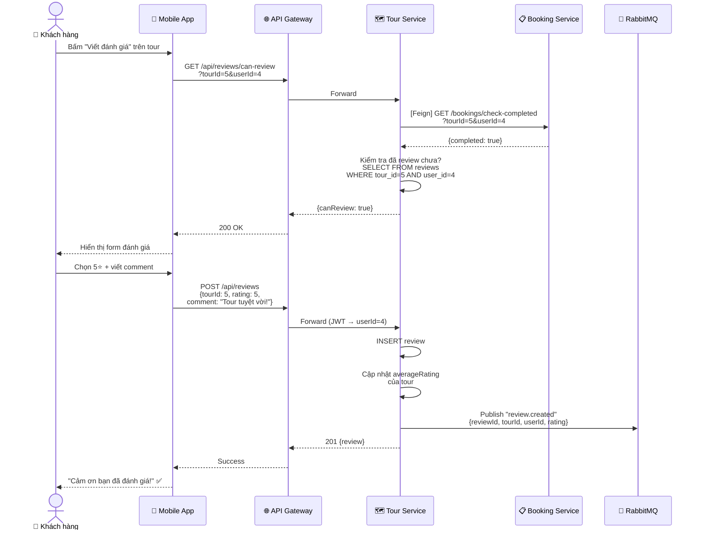

---

## 7. Quản Lý Chi Phí (Guide → Admin)

### 7.1 Flowchart — Luồng Chi Phí Tour

```mermaid
flowchart TD
    A([HDV tạo chi phí]) --> B[Chọn loại chi phí:<br/>Transport / Meals /<br/>Entrance / Equipment / Other]
    B --> C[Nhập số tiền & mô tả]
    C --> D{Có hóa đơn<br/>đính kèm?}
    
    D -->|Có| E[Chụp / Tải ảnh hóa đơn]
    D -->|Không| F[Bỏ qua]
    
    E --> G[Upload lên MinIO<br/>POST /storage/upload]
    G --> H[POST /expenses<br/>{tourId, category, amount,<br/>description, attachments}]
    F --> H
    
    H --> I[Expense status: PENDING]
    I --> J[Admin nhận thông báo<br/>chi phí mới]
    
    J --> K[Admin review<br/>trên Dashboard]
    K --> L{Quyết định}
    
    L -->|Duyệt| M[POST /expenses/{id}/approve]
    L -->|Từ chối| N[POST /expenses/{id}/reject<br/>{reason}]
    
    M --> O[Expense → APPROVED ✅]
    N --> P[Expense → REJECTED ❌]
    P --> Q[HDV nhận thông báo<br/>lý do từ chối]

    style O fill:#22c55e,color:#fff
    style P fill:#ef4444,color:#fff
```

### 7.2 Sequence Diagram — Gửi & Duyệt Chi Phí

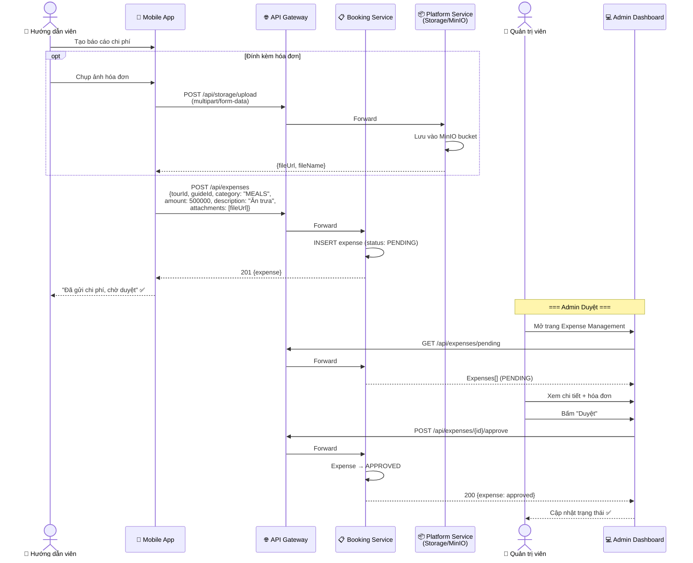

---

## 8. Thông Báo Realtime (Event-Driven)

### 8.1 Flowchart — Luồng Thông Báo

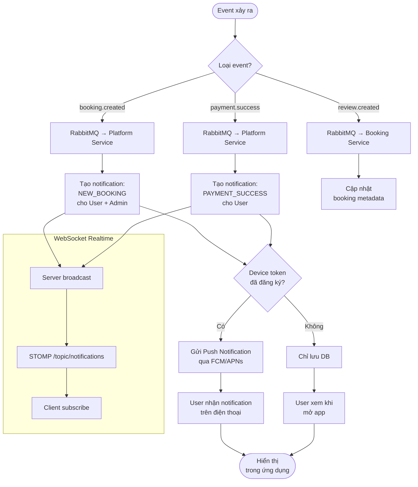

### 8.2 Sequence Diagram — Event Flow Booking → Notification

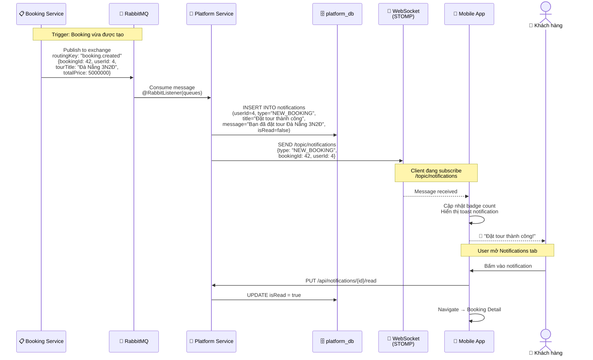

---

## 9. Quản Lý Tour (Admin CRUD)

### 9.1 Flowchart — Admin Tạo/Sửa Tour

```mermaid
flowchart TD
    A([Admin Dashboard]) --> B[Mở trang<br/>Tour Management]
    B --> C{Hành động?}
    
    C -->|Tạo mới| D[Bấm "Thêm Tour"]
    C -->|Chỉnh sửa| E[Chọn tour → Edit]
    C -->|Xóa| F[Chọn tour → Delete]
    
    D --> G[Nhập thông tin tour:<br/>- Tên, mô tả, vị trí<br/>- Giá, thời gian<br/>- Số chỗ tối đa]
    
    G --> H[Upload hình ảnh<br/>POST /storage/upload]
    H --> I[Thêm lịch khởi hành<br/>ngày, chỗ trống]
    I --> J[POST /tours<br/>{tour data}]
    
    J --> K{Thành công?}
    K -->|Có| L[Tour xuất hiện<br/>trên app ✅]
    K -->|Không| M[Hiển thị lỗi<br/>validation] --> G
    
    E --> N[Load tour data<br/>vào form]
    N --> O[Chỉnh sửa thông tin]
    O --> P[PUT /tours/{id}]
    P --> L
    
    F --> Q{Xác nhận xóa?}
    Q -->|Có| R[DELETE /tours/{id}]
    Q -->|Không| B
    R --> S{Có booking<br/>đang active?}
    S -->|Có| T[Không cho xóa ❌] --> B
    S -->|Không| U[Xóa thành công ✅] --> B

    style L fill:#22c55e,color:#fff
    style T fill:#ef4444,color:#fff
```

### 9.2 Sequence Diagram — Admin Tạo Tour Mới

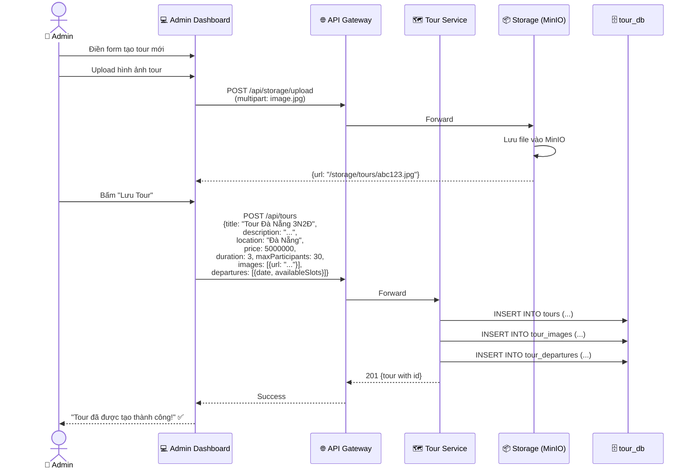

---

## 10. Quản Lý Booking (Admin)

### 10.1 Flowchart — Xử Lý Booking

```mermaid
flowchart TD
    A([Admin mở<br/>Booking Management]) --> B[GET /bookings<br/>Tải danh sách]
    B --> C[Hiển thị bảng bookings<br/>với filter & search]
    C --> D{Chọn hành động}
    
    D -->|Xem chi tiết| E[GET /bookings/{id}<br/>Hiển thị modal]
    D -->|Xác nhận| F{Payment đã<br/>SUCCESS?}
    D -->|Từ chối| G[POST /bookings/{id}/reject]
    D -->|Hoàn thành| H{Ngày tour<br/>đã qua?}
    
    F -->|Có| I[POST /bookings/{id}/confirm]
    F -->|Không| J[Thông báo: Chưa<br/>thanh toán ⚠️]
    
    I --> K[Booking → CONFIRMED ✅]
    G --> L[Booking → CANCELLED ❌]
    L --> M[Trả lại chỗ<br/>departure slots]
    
    H -->|Có| N[POST /bookings/{id}/complete]
    H -->|Không| O[Thông báo: Tour<br/>chưa kết thúc ⚠️]
    
    N --> P[Booking → COMPLETED ✅]
    P --> Q[User có thể<br/>viết đánh giá]

    style K fill:#22c55e,color:#fff
    style P fill:#22c55e,color:#fff
    style L fill:#ef4444,color:#fff
```

### 10.2 Sequence Diagram — Admin Xác Nhận Booking

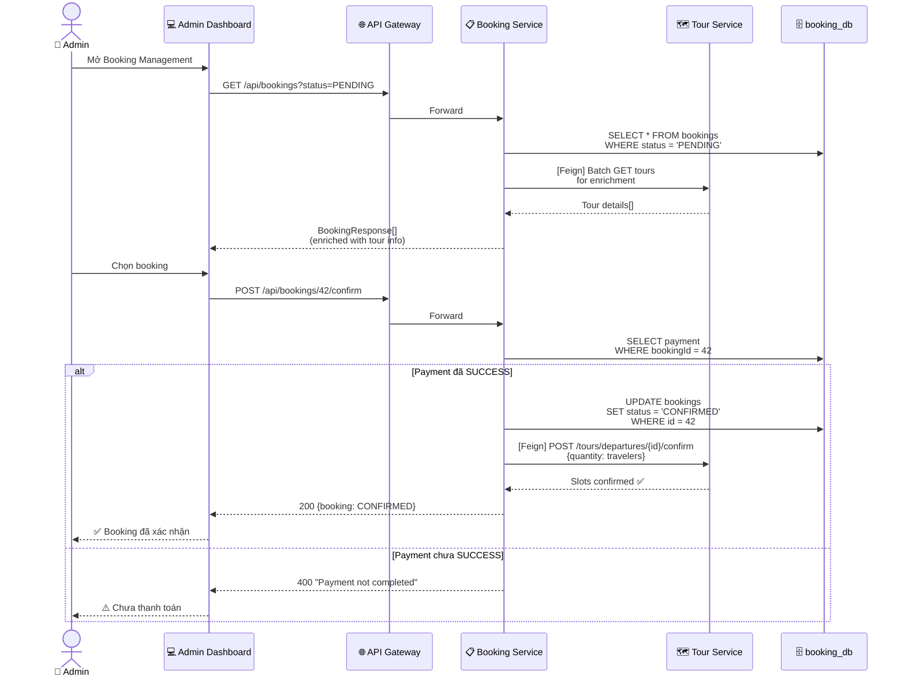

---

## Tổng Kết

| Sơ đồ | Flowchart | Sequence | Mô tả |
|-------|:---------:|:--------:|-------|
| Xác thực | ✅ | ✅ | Login, Register, JWT refresh |
| Khám phá tour | ✅ | ✅ | Tìm kiếm, chi tiết, yêu thích + Redis cache |
| Đặt tour (Saga) | ✅ | ✅ | Full saga: validate → reserve → create → itinerary → event |
| Thanh toán tiền mặt | ✅ | ✅ | Admin confirm cash |
| Thanh toán VietQR | ✅ | ✅ | SePay webhook, signature verify |
| Đánh giá | ✅ | ✅ | Eligibility check qua Feign, event publish |
| Chi phí (Guide) | ✅ | ✅ | Submit + attachment → Admin approve/reject |
| Thông báo realtime | ✅ | ✅ | RabbitMQ → Notification → WebSocket → Push |
| Admin quản lý tour | ✅ | ✅ | CRUD + MinIO upload |
| Admin quản lý booking | ✅ | ✅ | Confirm/Reject/Complete lifecycle |

> **Tổng cộng**: **10 flowcharts** + **10 sequence diagrams** = **20 sơ đồ**
