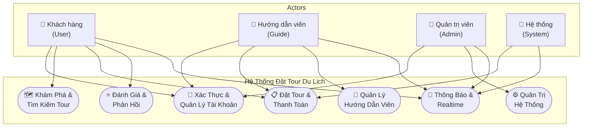
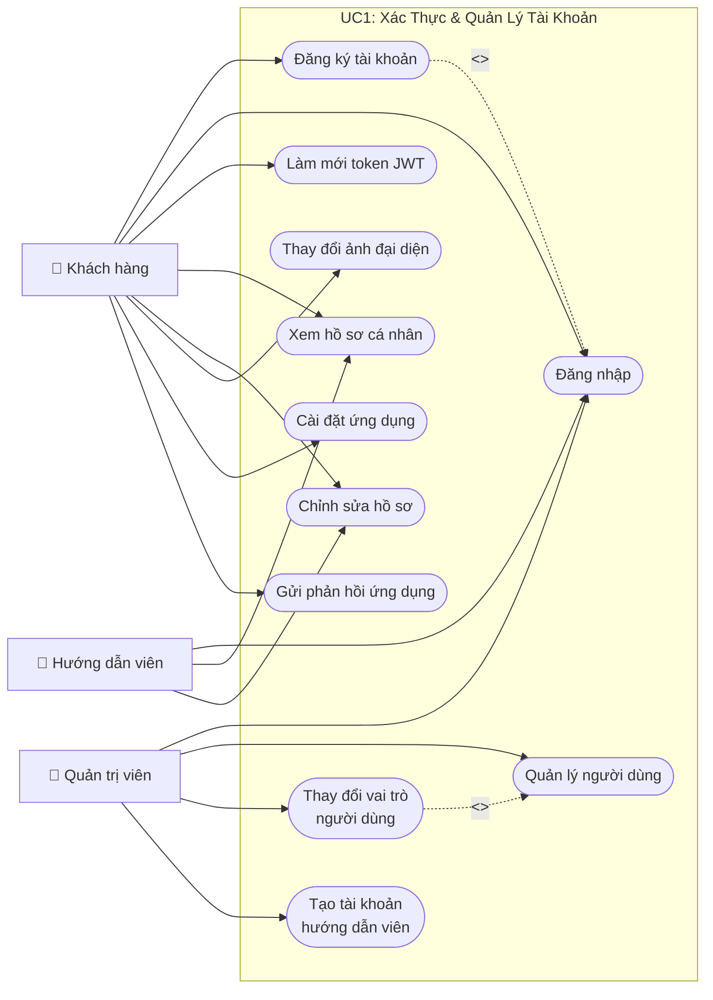
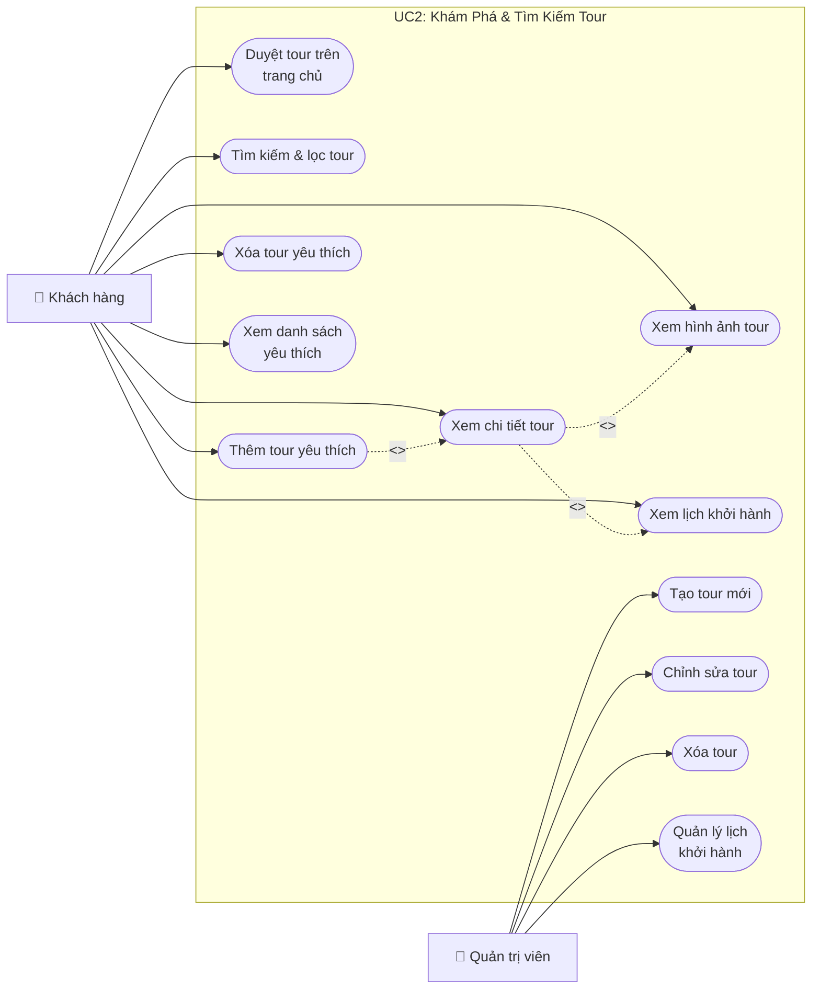
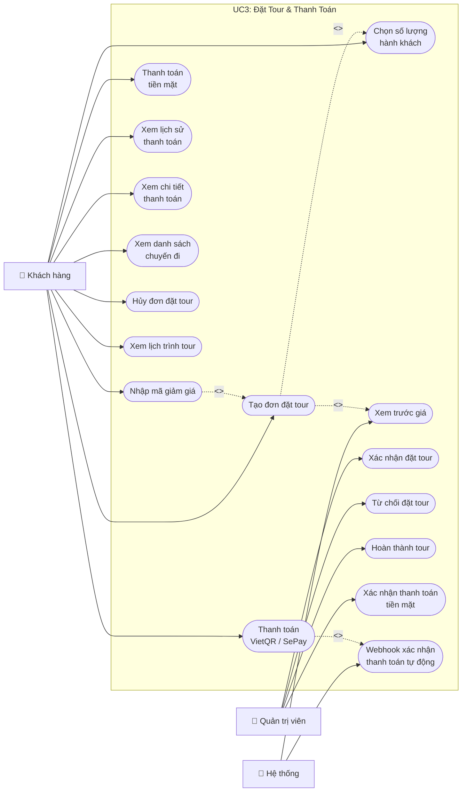
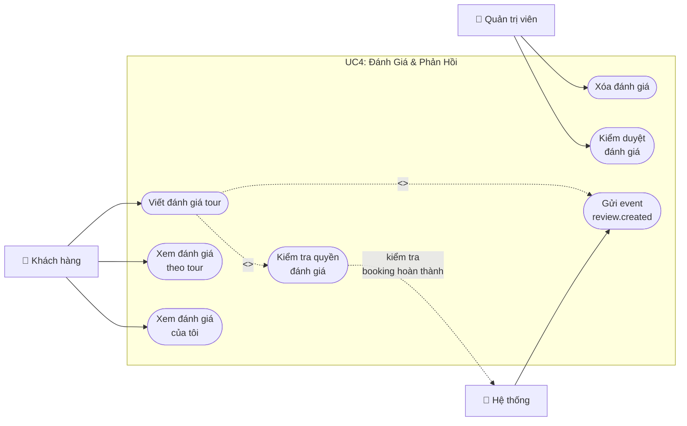
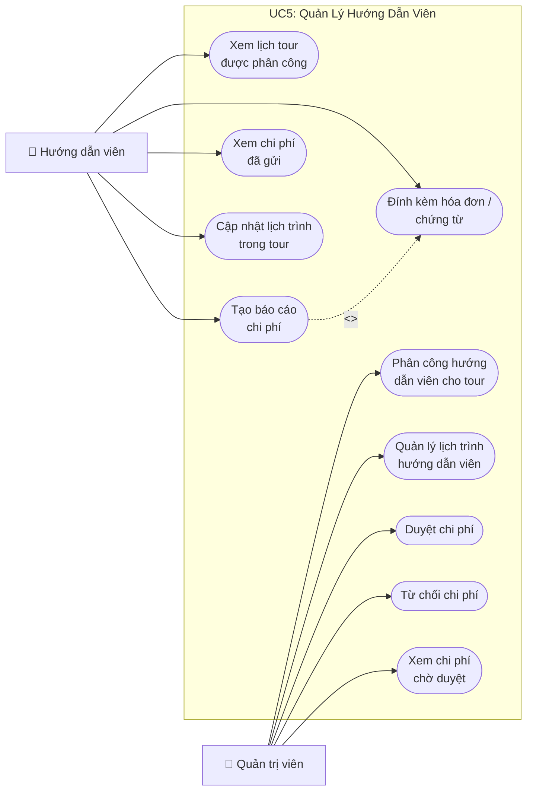
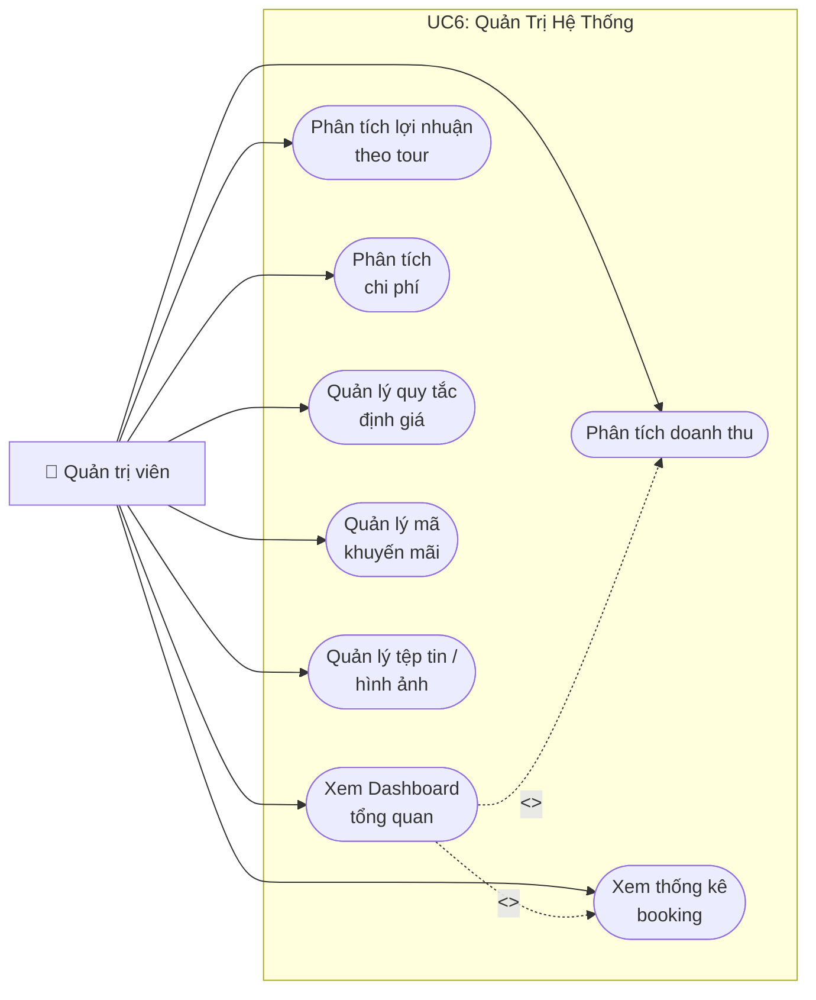
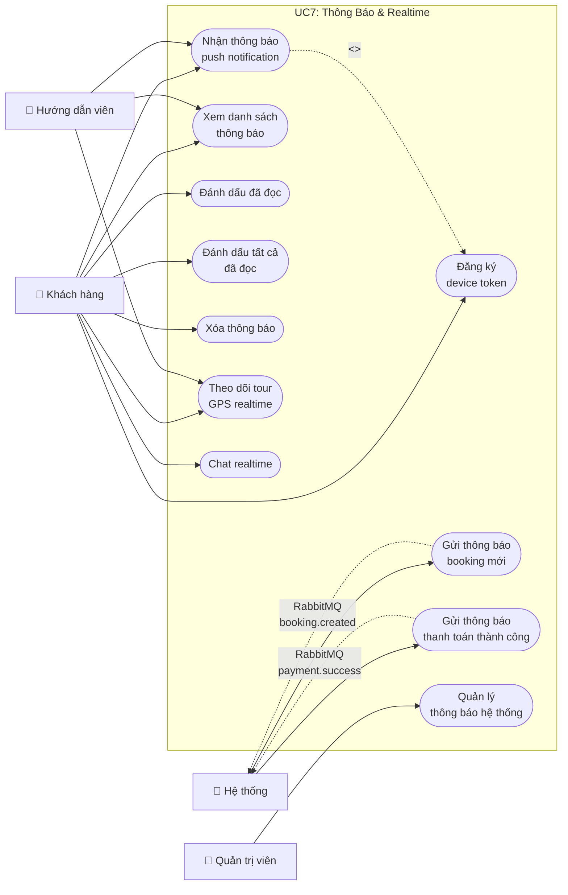

# Sơ Đồ Use Case — Ứng Dụng Đặt Tour Du Lịch (DuLich)

> **Tài liệu phân tích**: Mô tả tất cả các tác nhân (actors) và ca sử dụng (use cases) của hệ thống.

---

## 1. Tổng Quan Hệ Thống & Tác Nhân

### Các Tác Nhân (Actors)

| Tác nhân | Mô tả | Ví dụ |
|----------|-------|-------|
| **Khách hàng (User)** | Người dùng cuối, tìm kiếm và đặt tour du lịch | Đăng ký tài khoản, đặt tour, thanh toán |
| **Hướng dẫn viên (Guide)** | Nhân viên dẫn tour, quản lý chi phí và lịch trình | Tạo báo cáo chi phí, cập nhật lịch trình |
| **Quản trị viên (Admin)** | Người quản lý hệ thống | Quản lý tour, duyệt booking, phân tích doanh thu |
| **Hệ thống (System)** | Các quy trình tự động | Webhook thanh toán, thông báo realtime, event messaging |

### Kiến Trúc Microservices

| Service | Chức năng chính |
|---------|----------------|
| **identity-service** | Xác thực, Người dùng, Yêu thích |
| **tour-service** | Tour, Đánh giá, Định giá, Lịch trình, Hướng dẫn viên |
| **booking-service** | Đặt tour, Thanh toán, Chi phí, WebSocket |
| **platform-service** | Thông báo, Phân tích, Admin, Lưu trữ |

---

## 2. Sơ Đồ Tổng Quan (Overview Use Case)

---

## 3. Use Case 1: Xác Thực & Quản Lý Tài Khoản

> **Service**: identity-service | **Actors**: User, Guide, Admin

---

## 4. Use Case 2: Khám Phá & Tìm Kiếm Tour

> **Service**: tour-service | **Actors**: User

---

## 5. Use Case 3: Đặt Tour & Thanh Toán

> **Service**: booking-service | **Actors**: User, Admin, System

---

## 6. Use Case 4: Đánh Giá & Phản Hồi

> **Service**: tour-service | **Actors**: User, Admin

---

## 7. Use Case 5: Quản Lý Hướng Dẫn Viên & Chi Phí

> **Service**: tour-service + booking-service | **Actors**: Guide, Admin

---

## 8. Use Case 6: Quản Trị Hệ Thống & Phân Tích

> **Service**: platform-service + tất cả services | **Actor**: Admin

---

## 9. Use Case 7: Thông Báo & Realtime

> **Service**: platform-service + booking-service | **Actors**: User, Guide, System

---

## 10. Ma Trận Actors — Use Cases

| # | Use Case | User | Guide | Admin | System |
|---|----------|:----:|:-----:|:-----:|:------:|
| **Xác Thực** | | | | | |
| 1 | Đăng ký tài khoản | ✅ | | | |
| 2 | Đăng nhập | ✅ | ✅ | ✅ | |
| 3 | Làm mới token JWT | ✅ | ✅ | ✅ | |
| 4 | Xem/Sửa hồ sơ | ✅ | ✅ | | |
| 5 | Quản lý người dùng & vai trò | | | ✅ | |
| 6 | Tạo tài khoản HDV | | | ✅ | |
| **Tour & Khám Phá** | | | | | |
| 7 | Duyệt/Tìm kiếm tour | ✅ | | | |
| 8 | Xem chi tiết/ảnh/lịch khởi hành | ✅ | | | |
| 9 | Quản lý yêu thích | ✅ | | | |
| 10 | CRUD tour | | | ✅ | |
| **Đặt Tour & Thanh Toán** | | | | | |
| 11 | Tạo đơn đặt tour | ✅ | | | |
| 12 | Nhập mã giảm giá | ✅ | | | ✅ |
| 13 | Thanh toán (tiền mặt/VietQR) | ✅ | | | |
| 14 | Xem chuyến đi / lịch sử TT | ✅ | | | |
| 15 | Hủy đơn đặt tour | ✅ | | | |
| 16 | Xác nhận/Từ chối/Hoàn thành booking | | | ✅ | |
| 17 | Xác nhận thanh toán tiền mặt | | | ✅ | |
| 18 | Webhook thanh toán tự động | | | | ✅ |
| **Đánh Giá** | | | | | |
| 19 | Viết đánh giá | ✅ | | | |
| 20 | Xem đánh giá | ✅ | | | |
| 21 | Kiểm duyệt/Xóa đánh giá | | | ✅ | |
| **Hướng Dẫn Viên** | | | | | |
| 22 | Xem lịch tour được phân công | | ✅ | | |
| 23 | Tạo/Gửi báo cáo chi phí | | ✅ | | |
| 24 | Cập nhật lịch trình | | ✅ | | |
| 25 | Phân công HDV cho tour | | | ✅ | |
| 26 | Duyệt/Từ chối chi phí | | | ✅ | |
| **Quản Trị** | | | | | |
| 27 | Xem Dashboard KPI | | | ✅ | |
| 28 | Phân tích doanh thu/lợi nhuận | | | ✅ | |
| 29 | Quản lý định giá & khuyến mãi | | | ✅ | |
| 30 | Quản lý tệp tin/hình ảnh | | | ✅ | |
| **Thông Báo & Realtime** | | | | | |
| 31 | Nhận/Xem/Đánh dấu thông báo | ✅ | ✅ | | |
| 32 | Theo dõi GPS realtime | ✅ | ✅ | | |
| 33 | Chat realtime | ✅ | | | |
| 34 | Gửi thông báo tự động | | | | ✅ |

---

## 11. Tóm Tắt Thống Kê

| Metric | Số lượng |
|--------|----------|
| **Tổng Actors** | 4 (User, Guide, Admin, System) |
| **Tổng Use Cases** | 50+ |
| **Microservices** | 6 (Eureka, Gateway, Identity, Tour, Booking, Platform) |
| **Controllers** | 19 |
| **Entities** | 21 |
| **Screens (Mobile)** | 22 |
| **Admin Pages (Web)** | 10 |

---

> 📝 **Ghi chú**: Các sơ đồ sử dụng ký hiệu `<<include>>` (đường nét đứt) cho use case bắt buộc phải thực hiện, và `<<extend>>` cho use case tùy chọn mở rộng.
